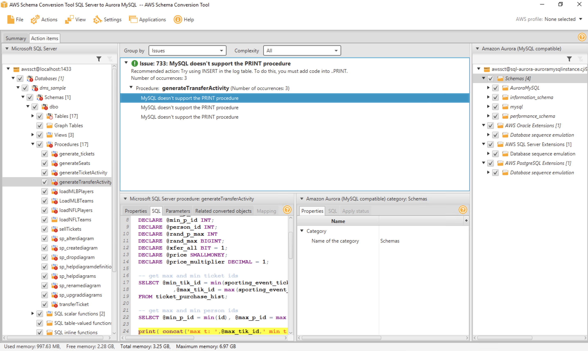

# Migrate your Microsoft SQL Database TO Amazon Aurora

Mystique Unicorn App backend is hosted on mysql db. Recenly one of their devs discovered that AWS offers Amazon Aurora a fast, scalable, highly available, and fully managed relational database service that supports MySQL workloads.

Can you help them migrate from mysql hosted on prem(or EC2) to Amazon Aurora?

## 🎯 Solutions

We will follow an multi-stage process to accomplish our goal. We need the following components to get this right,

1. **Source Database - MS SQL DB**
   - If in AWS: EC2 instance in a VPC, Security Group, SSH Keypair(Optional)
   - Some dummy data inside the database
   - SSIS pre-installed
   - MySQL Workbench pre-installed
1. **Destination Database - Amazon Aurora DB**
   - Subnet Groups
   - VPC Security Groups
1. **Database Migration Service(DMS) - Replication Instance**
   - DMS IAM Roles
   - Endpoints
   - Database Migration Tasks


In this article, we will build an architecture, similar to the one shown above - A simple database running mysql(mariadb 10.2.x) instance running on EC2 _(You are welcome to use your own mysqldb instead_). For target we will build a Amazon Aurora DB cluster and use DMS to migrate the data.

In this Workshop you will practice how to migrate your MS SQL DB databases to Amazon Aurora DB using different strategies.

1.  ## 🧰 Prerequisites

    This demo, instructions, scripts and cloudformation template is designed to be run in `us-east-1`. With few modifications you can try it out in other regions as well(_Not covered here_).

    - 🛠 AWS CLI Installed & Configured - [Get help here](https://youtu.be/TPyyfmQte0U)
    - 🛠 AWS CDK Installed & Configured - [Get help here](https://www.youtube.com/watch?v=MKwxpszw0Rc)
    - 🛠 Python Packages, _Change the below commands to suit your OS, the following is written for amzn linux 2_
      - Python3 - `yum install -y python3`
      - Python Pip - `yum install -y python-pip`
      - Virtualenv - `pip3 install virtualenv`

    As there are a number of components that need to be setup, we will use a combination of Cloudformation(generated from CDK), CLI & GUI.

1.  ## ⚙️ Setting up the environment

    - Get the application code

      ```bash
      git clone https://github.com/miztiik/mssql-to-aurora
      cd mssql-to-aurora
      ```

      **NOTE: RUN THIS STACK IN VIRIGINA ONLY._The MS SQL AMI in th stack is from virigin region_**

1.  ## 🚀 Prepare the environment

    We will need cdk to be installed to make our deployments easier. Lets go ahead and install the necessary components.

    ```bash
    # If you DONT have cdk installed
    npm install -g aws-cdk

    # Make sure you in root directory
    python3 -m venv .env
    source .env/bin/activate
    pip3 install -r requirements.txt
    ```

    The very first time you deploy an AWS CDK app into an environment _(account/region)_, you’ll need to install a `bootstrap stack`, Otherwise just go ahead and deploy using `cdk deploy`.

    ```bash
    cdk bootstrap
    cdk ls
    # Follow on screen prompts
    ```

    You should see an output of the available stacks,

    ```bash
    vpc-stack
    database-migration-prerequisite-stack
    mssql-on-windows-ec2
    ```

1.  ## 🚀 Deploying the Target Database - Amazon Aurora DB

    We can automate the creation of Amazon Aurora DB & DMS using CDK, But since this will be the first time we use these services,let us use the Console/GUI to set them up. We can leverage the excellant [documentation from AWS](https://docs.aws.amazon.com/AmazonRDS/latest/AuroraUserGuide/CHAP_GettingStartedAurora.CreatingConnecting.Aurora.html) on how to setup our Aurora DB. (Use your best judgement, as docs tend to change over a period of time)

    Couple of things to note,

    - For VPC - Use our custom VPC `miztiikMigrationVpc`
    - For Security Group - Use `mysql_db_sg_database-migration-prerequisite-stack`
    - Set the admin name as `auroraadmin`
    - Set your password

    ```bash
    wget https://s3.amazonaws.com/rds-downloads/rds-combined-ca-bundle.pem
    ```

    Make a note of the db endpoint, admin user name and password. We will use it later.

1.  ## 🚀 Deploying the Source Database

    Let us walk through each of the stacks,

    - **Stack: vpc-stack**
      This stack will do the following,

      1. Create an custom VPC `miztiikMigrationVpc`(_We will use this VPC to host our source MS SQL DB, Aurora DB, DMS Replication Instance_)

      Initiate the deployment with the following command,

      ```bash
      cdk deploy vpc-stack
      ```

    - **Stack: database-migration-prerequisite-stack**
      This stack will create the following resources,

      1. Aurora DB & DMS Security groups - (_created during the prerequisite stack_)
         - Port - `3306` _Accessible only from within the VPC_
      1. DMS IAM Roles - (This stack will **FAIL**, If these roles already exist in your account)
         - `AmazonDMSVPCManagementRole`
         - `AmazonDMSCloudWatchLogsRole`
      1. SSH KeyPair using a custom cfn resource
         - The key material is stored in SSM Parameter Store `mystique-automation-ssh-key`

      Initiate the deployment with the following command,

      ```bash
      cdk deploy database-migration-prerequisite-stack
      ```

      After successful completion, take a look at all the resources and get yourself familiar with them. We will be using them in the future.

    - **Stack: `mssql-on-windows-ec2` Source Database - MS SQL DB**

      We will be using AWS prepared provided AMI. This AMI comes preinstalled with MSSQL DB, SSIS. MySQL WorkBench and Amazon Schema Conversion Tool(SCT). The stack has been designed to use the `viriginia : us-east-1` AMI. If you plan to run on other regions, you can use the below AMI IDs. Now lets continue with virginia
      `viriginia : us-east-1 : ami-045d48ee4dd4f5210`
      `us-east-2 : Ohio : ami-021e119b2b955586a`
      `us-west-2 : Oregon : ami-04f6666670bad6990`

      This stack will do the following,

      1. Create an EC2 `m5.large` instance inside our custom VPC(_created during the prerequisite stack_)
      1. Attach security group with MS SQL port(`1433`) open within the VPC (_For any use-case other than sandbox testing, you might want to restrict it_)

      Initiate the deployment with the following command,

      ```bash
      cdk deploy mssql-on-windows-ec2
      ```

      As we need to migrate from Microsoft SQL to Amazon Aurora, We need to ensure the schema is compatible between two database engine. We will use the Amazon SCT to achieve that.

      **Prepare Source MS SQL Server**

      - Log In to the EC2 server.
        1. To get the Administrator password, Use the SSH key from the SSM Parameter Store.
      - On the EC2 server, open the _DMS Workshop_ folder that is on the Desktop. Then, double-click on _AWS Schema Conversion Tool_ Download to get the latest version of the software. - Continue with the installation
        | Parameter | Value |
        | ---------------------- | -------------------------------------------------------------------------- |
        | Project Name | AWS Schema Conversion Tool SQL Server to Aurora MySQL |
        | Location | C:\Users\Administrator\AWS Schema Conversion Tool |
        | Database Type | Transactional Database (OLTP) |
        | Source Database Engine | Microsoft SQL Server / I want to switch engines and optimize for the cloud |
      - Continue to **Next**
        - Use these values
          | Parameter | Value |
          | -------------------------------- | ------------------------------------------------------------------------------------------ |
          | Project Name | localhost |
          | Server | Port 1433 |
          | Instance Name | |
          | Authentication | SQL Server Authentication |
          | User Name | awssct |
          | Password | Password1 |
          | Use SSL | Unchecked |
          | Store Password | Checked |
          | Microsoft SQL Server Driver Path | C:\Users\Administrator\Desktop\DMS Workshop\JDBC\sqljdbc_7.4\enu\mssql-jdbc-7.4.1.jre8.jar |
      - You may see a security warning prompot to use SSL. Click on “Accept the Risk and continue” button.
        - 
      - Select the `dms_sample` database, then click Next.
        - 
      - Click **Next** and loading metadata, you may get a warning message saying: _Metadata loading was intrupted because of data fetching issues_. You can ignore this message for now.
      - SCT will examine in detail all of the objects in the schema of source database. It will convert as much as possible automatically and provides detailed information about items it could not convert. Generally, packages, procedures, and functions are more likely to have some issues to resolve because they contain the most custom or proprietary SQL code. AWS SCT specifies how much manual change is needed to convert each object type. It also provides hints about how to adapt these objects to the target schema successfully.
        - 
      - Review the database migration assessment report, click **Next**. Specify the target database configurations in the form, and then click Test Connection. Once the connection is successfully tested, click **Finish**.
        | Parameter | Value |
        | ----------------- | ---------------------------------------------------------------------------------- |
        | Target | Database Engine Amazon Aurora (MySQL compatible) |
        | Server | Name < TargetAuroraMySQLEndpoint > |
        | Server | Port 3306 |
        | User Name | auroraadmin |
        | Password | YOUR_PASSWORD |
        | Use | SSL Unchecked |
        | Store Password | Checked |
        | MySQL Driver Path | `C:\Users\Administrator\Desktop\DMS Workshop\JDBC\mysql-connector-java-8.0.16.jar` |

        - 

      - Now that you have created a new Database Migration Project, the next step is to convert the SQL Server schema of the source database to the Amazon Aurora. Click on the _View_ button, and choose **Assessment Report view**.
        - 
      - AWS SCT analyses the schema and creates a database migration assessment report for the conversion to Aurora MySQL. Items with a blue mark next to them cannot be directly translated from the source to the target. In this case, this includes the stored procedures. For each conversion issue, you can complete one of the following actions:
        1. Modify the objects on the source SQL Server database so that AWS SCT can convert the objects to the target Aurora MySQL database.
        1. Instead of modifying the source schema, modify scripts that AWS SCT generates before applying the scripts on the target Aurora MySQL database.
           For the sake of time, we skip modifying all the objects that could not be automatically converted. Instead, as an example, you will manually modify one of the stored procedures from within SCT to make it compatible with the target database.
        - 
      - From the left panel, uncheck the items with the exclamation mark except for the `generateTransferActivity` procedure.
        - 
      - Next, click on the generateTransferActivity procedure. Observe how the SCT highlights the issue, stating that MySQL does not support the PRINT procedure. To fix this, you simply need to replace the three highlighted PRINT statements with SELECT statement as demonstrated in the following example:

      MS SQL Server syntax:

      ```sql
      PRINT (concat('max t: ',@max_tik_id,' min t: ', @min_tik_id, 'max p: ',@max_p_id,' min p: ', @min_p_id));
      ```

      MySQL syntax:

      ```sql
      SELECT concat('max t: ',@max_tik_id,' min t: ', @min_tik_id, 'max p: ',@max_p_id,' min p: ', @min_p_id);
      ```

      - After you make the modification, right-click on the `dbo` schema, and choose **Create Report**. Observe that the schema of the source database is now **fully compatible** with the target database.

      - 

      - Right click on the `dms_sample` database in the left panel and select Convert Schema to generate the data definition language (DDL) statements for the target database.

        **NOTE** When warned that objects may already exist in database, click **Yes**.

      - 

      - Right click on the `dms_sample_dbo` schema in the right-hand panel, and click **Apply to database**.
      - 
      - When prompted if you want to apply the schema to the database, click **Yes**.

      - At this point, the schema has been applied to the target database. Expand the `dms_sample_dbo` schema to see the tables.
      - 

      You have sucessfully converted the database schema and object from Microsoft SQL Server to the format compatible with Amazon Aurora (MySQL).

      This part demonstrated how easy it is to migrate the schema of a Microsoft SQL Server database into Amazon Aurora (MySQL) using the AWS Schema Conversion Tool. Similarly, you learned how the Schema Conversion Tool highlights the differences between different database engine dialects, and provides you with tips on how you can successfully modify the code when needed to migrate procedure and other database objects.

      For Microsoft SQL Server, AWS DMS<sup>[1]</sup> uses MS-Replication or MS-CDC to write information to the SQL Server transaction log. It then uses the `fn_dblog()` or `fn_dump_dblog()` function in SQL Server to read the changes in the transaction log based on the log sequence number (LSN). Replication requires a primary key for all tables that are being replicated. If your tables don’t have primary keys defined, consider using MS-CDC instead.

      **Enabling Replication on SOURCE Database:**

      - Open `mssql-on-windows-ec2/mysql_to_rds/stacks/back_end/bootstrap_scripts/prep_source_sql_ConfigSourceSQLServer.sql` with a text editor on your computer.
      - Copy the content to SQL Server Management Studio query editor.
      - Execute the script.

        - 

        Now we are all done with our source database.

      **Prepare TARGET: Aurora My SQL**
      During the _full load_ process, AWS DMS as default does not load tables in any particular order, so it might load child table data before parent table data. As a result, foreign key constraints might be violated if they are enabled. Also, if triggers are present on the target database, they might change data loaded by AWS DMS in unexpected ways. To overcome this, we drop the constraints on the target database.

      - Open **MySQL Workbench CE** from within the EC2 server, and create a new database connection for the target Aurora database using the following values:

        | Parameter  | Value                          |
        | ---------- | ------------------------------ |
        | Connection | Name Target Aurora RDS (MySQL) |
        | Host Name  | <TargetAuroraMySQLEndpoint>    |
        | Port       | 3306                           |
        | Username   | auroraadmin                    |
        | Password   | YOUR_PASSWORD                  |

        - 

        After you receive a message stating “Successfully made the MySQL connection”, click _OK_. Click on the **Target Aurora RDS (MySQL)** from the list of MySQL Connections in SQL Workbench to connect to the target database

      - In this step you are going to drop the foreign key constraint from the target database:

        1. Within MySQL Workbench, click on the File menu, and choose New Query Tab.
        1. Open `prep_target_rds_DropConstraintsSQLServer.sql` with a text editor on your computer.
        1. Copy the content to MySQL Workbench query editor.
        1. Execute the script.

        - 

        Now we are all done with our target database & ready for migration.

1.  ## 🚀 Deploying the DMS Replication Instance

    We can leverage the excellant [documentation from AWS](https://docs.aws.amazon.com/dms/latest/userguide/CHAP_GettingStarted.html) on how to setup our DMS Replication Instance.

    Couple of things to note,

    - For VPC - Use our custom VPC `miztiikMigrationVpc`
    - For Security Group - Use `dms_sg_database-migration-prerequisite-stack`

    After creating the replication instance, We need to create few more resources to begin our replication. We will use defaults mostly

    - **Endpoints for source MS SQL DB**(_custom values listed below_)

      | Parameter           | Value                                            |
      | ------------------- | ------------------------------------------------ |
      | Endpoint            | Type Source endpoint                             |
      | Endpoint Identifier | `sqlserver-source`                               |
      | Source Engine       | `sqlserver`                                      |
      | Server Name         | < SourceEC2PrivateDns >                          |
      | Port                | 1433                                             |
      | SSL Mode            | none                                             |
      | User Name           | `awssct`                                         |
      | Password            | `Password1`                                      |
      | Database Name       | `dms_sample`                                     |
      | Test                | endpoint connection -> VPC `miztiikMigrationVpc` |
      | Replication         | Instance DMSReplication                          |

    - **Endpoint for destination databases - Amazon Aurora DB**(_custom values listed below_)

      | Parameter            | Value                                            |
      | -------------------- | ------------------------------------------------ |
      | Endpoint             | Type Target endpoint                             |
      | Select               | RDS DB instance                                  |
      | Endpoint Identifier  | `aurora-target`                                  |
      | Source Engine        | aurora                                           |
      | Server Name          | < TargetAuroraMySQLEndpoint >                    |
      | Port                 | 3306                                             |
      | SSL Mode             | none                                             |
      | User Name            | `auroraadmin`                                    |
      | Password             | `Password1`                                      |
      | Test                 | endpoint connection -> VPC `miztiikMigrationVpc` |
      | Replication Instance | DMSReplication                                   |

    - **Database Migration Task**

      - Click on Database migration tasks on the left-hand menu, then click on the Create task button on the top right corner.

      | Parameter                           | Value                                               |
      | ----------------------------------- | --------------------------------------------------- |
      | Task identifier                     | AuroraMigrationTask                                 |
      | Replication instance                | DMSReplication                                      |
      | Source database endpoint            | `sqlserver-source`                                  |
      | Target database endpoint            | `aurora-target`                                     |
      | Migration type                      | Migrate existing data and replicate ongoing changes |
      | Start task on create                | Checked                                             |
      | CDC stop mode                       | Don’t use custom CDC stop mode                      |
      | Target table preparation mode       | Do nothing                                          |
      | Stop task after full load completes | Don’t stop                                          |
      | Include LOB columns in replication  | Limited LOB mode                                    |
      | Max LOB size (KB)                   | 32                                                  |
      | Enable validation                   | Checked                                             |
      | Enable CloudWatch logs              | Checked                                             |

      - Expand the Table mappings section, and select Guided UI for the editing mode.

      - Click on Add new selection rule button and enter the following values in the form:

      | Parameter  | Value   |
      | ---------- | ------- |
      | Schema     | `dbo`   |
      | Table name | %       |
      | Action     | Include |

      - Create Task. At this point, the task should start running and replicating data from the `dms_sample` database running on EC2 to the Amazon Aurora RDS (MySQL) instance.

1.  ## 🔬 Test Full Data Load and Continuous Replication

    Navigate to DMS task, under `Table Statistics` You should be able observe that the dms has copied the data from source to target database. You can connect to Aurora DB and test the records using the same commands that we used with source earlier.

    - Connect to Aurora from MySQL WorkBench and query for data,

    ```sql
    SELECT *
    FROM dms_sample_dbo.sport_type;
    ```

    - **AFTER** initial load is completed, use the following script to enable the foreign key constraints that we dropped earlier:
      1. Within MySQL Workbench, click on the File menu, and choose New Query Tab.
      1. Open `prep_target_rds_ddConstraintsSQLServer.sql` with a text editor on your computer.
      1. Copy the content to MySQL Workbench query editor.
      1. Execute the script.

    Now you are going to simulate a transaction to the source database by updating the sport_type table. The Database Migration Service will automatically detect and replicate these changes to the target database.

    - Use Microsoft SQL Server Management Studio to connect to the Source SQL Server on the EC2 instance.
    - Open a New Query window and execute the following statement to insert 5 new sports into the `sport_type` table:

    ```sql
    use dms_sample
    BULK INSERT dbo.sport_type
    FROM 'C:\Users\Administrator\Desktop\DMS Workshop\Scripts\sports.csv'
    WITH
    (
        FIRSTROW = 2,
        FIELDTERMINATOR = ',',
        ROWTERMINATOR = '\n',
        TABLOCK
    );
    ```

    - Connect to target DB from MySQL Workbench & check for new records,

    ```sql
    SELECT *
    FROM dms_sample_dbo.sport_type;
    ```

    You should be able to observe that there are `7` records now.

    - 

    _Additional Learnings:_ You can check the logs in cloudwatch for more information or increase the logging level of the database migration task.

1.  ## 📒 Conclusion

    Here we have demonstrated how to use Amazon Database Migration Service(DMS) to migrate data from MS SQL DB to Aurora DB.

1.  ## 🎯 Additional Exercises

    - Try and fix the other stored procedure that were excluded.

1.  ## 📊 📈 Performance Tips

    If your table has volume transactions, > 100 tps, then you can try these,

    - Create muliple replication instances
    - Create tasks for each of the tables to be migrated
    - Perform full load and CDC

1)  ## 🧹 CleanUp

    If you want to destroy all the resources created by the stack, Execute the below command to delete the stack, or _you can delete the stack from console as well_

    - Resources created during [Deploying The Application](#deploying-the-application)
    - Delete CloudWatch Lambda LogGroups
    - _Any other custom resources, you have created for this demo_

    ```bash
    # Delete from cdk
    cdk destroy

    # Follow any on-screen prompts

    # Delete the CF Stack, If you used cloudformation to deploy the stack.
    aws cloudformation delete-stack \
        --stack-name "MiztiikAutomationStack" \
        --region "${AWS_REGION}"
    ```

    This is not an exhaustive list, please carry out other necessary steps as maybe applicable to your needs.

## 📌 Who is using this

This repository aims to teach api best practices to new developers, Solution Architects & Ops Engineers in AWS. Based on that knowledge these Udemy [course #1][103], [course #2][102] helps you build complete architecture in AWS.

### 💡 Help/Suggestions or 🐛 Bugs

Thank you for your interest in contributing to our project. Whether it's a bug report, new feature, correction, or additional documentation or solutions, we greatly value feedback and contributions from our community. [Start here][200]

### 👋 Buy me a coffee

[](https://ko-fi.com/Q5Q41QDGK) Buy me a [coffee ☕][900].

### 📚 References

1. [Creating tasks for ongoing replication using AWS DMS][1]

1. [Using a Microsoft SQL Server database as a source for AWS DMS][2]

### 🏷️ Metadata


**Level**: 300

[1]: https://docs.aws.amazon.com/dms/latest/userguide/CHAP_Task.CDC.html
[2]: https://docs.aws.amazon.com/dms/latest/userguide/CHAP_Source.SQLServer.html
[100]: https://www.udemy.com/course/aws-cloud-security/?referralCode=B7F1B6C78B45ADAF77A9
[101]: https://www.udemy.com/course/aws-cloud-security-proactive-way/?referralCode=71DC542AD4481309A441
[102]: https://www.udemy.com/course/aws-cloud-development-kit-from-beginner-to-professional/?referralCode=E15D7FB64E417C547579
[103]: https://www.udemy.com/course/aws-cloudformation-basics?referralCode=93AD3B1530BC871093D6
[200]: https://github.com/miztiik/api-with-stage-variables/issues
[899]: https://www.udemy.com/user/n-kumar/
[900]: https://ko-fi.com/miztiik
[901]: https://ko-fi.com/Q5Q41QDGK
